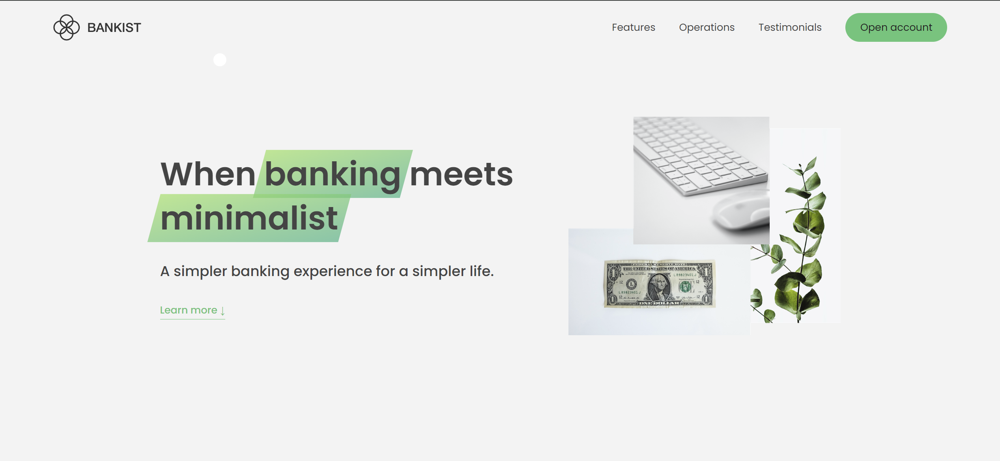
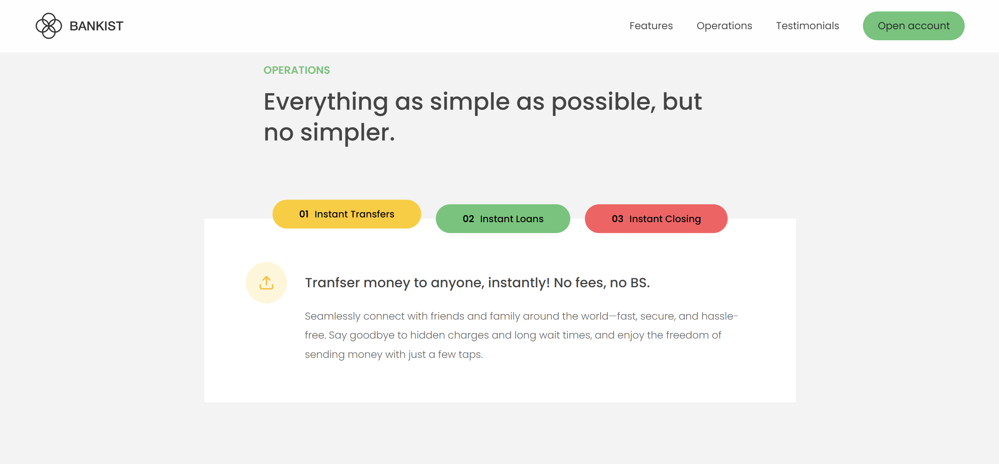
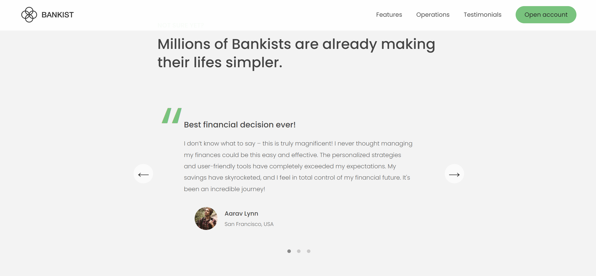

--
# Bankist Web App

## Description
This is a website for the **Bankist Web App** project. It provides a modern banking interface for users, featuring a sleek design and intuitive components. The project is developed with a focus on simplicity, accessibility, and user experience.

## Website Pictures
The following images are included to provide visual references for the web app:

### Main Page

*Description: The main landing page of the Bankist Web App, showcasing the overall layout and design.*

### Component

*Description: A screenshot of one of the core components used in the application, highlighting its functionality and interaction.*

### Testimonial Section

*Description: A section of the website displaying customer testimonials, helping to build trust and credibility.*

## Technologies Used
- HTML5
- CSS3
- JavaScript

## Future Enhancements
- Adding additional features such as user authentication, transaction history, and more.
- Improving the design and responsiveness for mobile devices.

## License
This project is licensed under the MIT License - see the LICENSE file for details.
---
